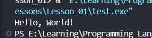

<div align="center">

# 🌐 HTML Learning Portfolio

### _For Undergraduate Computer Science Studies_

[](https://www.linkedin.com/in/mrnexora/)
[](https://github.com/mr-nexora/)

</div>

---

### 📝 Metadata & Credits

| Attribute               | Details                                                              |
| :---------------------- | :------------------------------------------------------------------- |
| **Author**              | T.M.S.U. Thennakoon (Sahan Udara)                                    |
| **Academic Context**    | Computer Science Undergraduate                                       |
| **Credits & Resources** | Inspired and learned via [W3Schools](https://www.w3schools.com/cpp/) |

> ⚠️ **Copyright Note**  
> Copyright (c) 2026 T.M.S.U. Thennakoon (Sahan Udara). All rights reserved.

---

# 💻 Lesson 02: C++ Basic Syntax

This lesson breaks down the foundational syntax of a C++ program. Understanding these structural components is essential before moving into logic building and advanced programming concepts.

---

## 📑 Understanding the Structure of a C++ Program

Every C++ script follows a strict structure. Let's look at a basic example where a standard header configuration is assumed, focusing directly on the anatomy of the `main()` execution context.

### 1️⃣ Example 01: Standard Text Output

Below is a simple console application structure that outputs a string of text to the terminal.

```CPP
    // test1.cpp
    int main () {

        // Print Text 
        cout << "Hello, World!";

        return 0;
    }
```


### Code Breakdown:
    - int main(): This is the entry point of every C++ program. The execution always begins from this function. The curly braces {} enclose the block of code to be executed.

    - cout: Pronounced as "see-out" (Character Output). It is used together with the insertion operator (<<) to print text or data to the screen.

    - ; (Semicolon): Every complete statement in C++ must end with a semicolon. It acts as a terminator telling the compiler that a line of instruction is complete.

    - return 0;: Concludes the execution of the main() function and returns the integer value 0 to the operating system, signifying successful program execution.
---
### Omitting Namespace

In real-world production or advanced computer science modules, relying blindly on a global namespace framework is discouraged to avoid naming conflicts. When we omit using namespace std;, we must explicitly call standard library functions using the scope resolution operator (::).

#### 2️⃣ Example 02: Using Explicit Namespace Scope
Here is how you write the exact same application structure without declaring a global namespace at the top of your file.
```CPP
    // test2.cpp
    int main()
    {

        // Print Text
        std::cout << "Hello, World!";

        return 0;
    }
```

