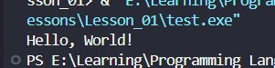

<div align="center">

# 🚀 C++ Learning Portfolio

### Building My Full Stack Development Journey, One Lesson at a Time.


<br><br>

<a href="https://github.com/mr-nexora">

</a>

<a href="https://www.linkedin.com/in/mrnexora/">

</a>

<a href="https://mr-nexora.github.io/mr-nexora-personal-portfolio/">

</a>

</div>

---

# 👋 Welcome

Welcome to my **C++ Learning Repository**.

This repository documents my complete learning journey in C++ as part of my Full Stack Development roadmap. Every lesson includes well-organized source code, explanations, screenshots, practice exercises, and mini projects to strengthen my programming, problem-solving, and object-oriented programming skills.

---

# 📂 Repository Overview

| 📌 Information | Details |
|:---------------|:--------|
| 👨‍💻 Author | **T.M.S.U. Thennakoon (Sahan Udara)** |
| 🎓 Program | Computer Science Undergraduate |
| 💻 Technology | C++ |
| 📚 Learning Method | Daily Lessons & Hands-on Practice |
| 🎯 Goal | Become a Professional Full Stack Developer |
| 📅 Repository Started | 2026 |

---

# ✨ What's Inside

- 📖 Structured Lessons
- 💻 Source Code
- 📷 Output Screenshots
- 📝 Markdown Notes
- 🚀 Mini Projects
- 📚 Practice Exercises
- 📈 Continuous Progress Updates

---

# 🌍 Connect With Me

<div align="center">

<a href="https://github.com/mr-nexora">

</a>

<a href="https://www.linkedin.com/in/mrnexora/">

</a>

<a href="https://mr-nexora.github.io/mr-nexora-personal-portfolio/">

</a>

</div>

---

# 📚 Learning Resources

This repository is built through continuous practice using educational resources such as:

- [W3Schools](https://www.w3schools.com/cpp/) 

---

# ⚖️ Copyright

> **© 2026 T.M.S.U. Thennakoon (Sahan Udara). All Rights Reserved.**
>
> This repository has been created for educational, portfolio, and personal learning purposes.
>
> You are welcome to explore this repository, learn from the code, and use the examples as a reference for your own learning and personal projects.
>If this repository helps you in your learning journey, a star ⭐ or proper credit is always appreciated.

---
<div align="center">

⭐ If you find this repository useful, consider giving it a Star.

Happy Coding! 🚀

</div>

---

# 💻 Lesson 02: C++ Basic Syntax

This lesson breaks down the foundational syntax of a C++ program. Understanding these structural components is essential before moving into logic building and advanced programming concepts.

---

## 📑 Understanding the Structure of a C++ Program

Every C++ script follows a strict structure. Let's look at a basic example where a standard header configuration is assumed, focusing directly on the anatomy of the `main()` execution context.

### 1️⃣ Example 01: Standard Text Output

Below is a simple console application structure that outputs a string of text to the terminal.

```CPP
    // test1.cpp
    int main () {

        // Print Text 
        cout << "Hello, World!";

        return 0;
    }
```


### Code Breakdown:
    - int main(): This is the entry point of every C++ program. The execution always begins from this function. The curly braces {} enclose the block of code to be executed.

    - cout: Pronounced as "see-out" (Character Output). It is used together with the insertion operator (<<) to print text or data to the screen.

    - ; (Semicolon): Every complete statement in C++ must end with a semicolon. It acts as a terminator telling the compiler that a line of instruction is complete.

    - return 0;: Concludes the execution of the main() function and returns the integer value 0 to the operating system, signifying successful program execution.
---
### Omitting Namespace

In real-world production or advanced computer science modules, relying blindly on a global namespace framework is discouraged to avoid naming conflicts. When we omit using namespace std;, we must explicitly call standard library functions using the scope resolution operator (::).

#### 2️⃣ Example 02: Using Explicit Namespace Scope
Here is how you write the exact same application structure without declaring a global namespace at the top of your file.
```CPP
    // test2.cpp
    int main()
    {

        // Print Text
        std::cout << "Hello, World!";

        return 0;
    }
```

