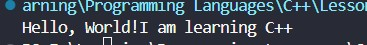
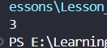
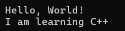
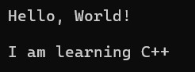
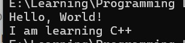

<div align="center">

# 🌐 HTML Learning Portfolio

### _For Undergraduate Computer Science Studies_

[](https://www.linkedin.com/in/mrnexora/)
[](https://github.com/mr-nexora/)

</div>

---

### 📝 Metadata & Credits

| Attribute               | Details                                                              |
| :---------------------- | :------------------------------------------------------------------- |
| **Author**              | T.M.S.U. Thennakoon (Sahan Udara)                                    |
| **Academic Context**    | Computer Science Undergraduate                                       |
| **Credits & Resources** | Inspired and learned via [W3Schools](https://www.w3schools.com/cpp/) |

> ⚠️ **Copyright Note**  
> Copyright (c) 2026 T.M.S.U. Thennakoon (Sahan Udara). All rights reserved.

---

# 🖥️ Lesson 03: C++ Output & New Lines

This lesson focuses on controlling console outputs in C++. You will learn how to print text and numeric configurations, along with methods to manage layout spaces using escape characters and stream manipulators.

---

## 📤 1. Standard Data Output

In C++, `cout` handles sequential data streams. By default, sequential calls to `cout` print continuous text without adding line breaks automatically.

### 📝 Printing Text
When outputting text strings, characters must be wrapped inside double quotation marks (`""`).

```CPP
    // test1.cpp
int main () {

    cout << "Hello, World!";
    cout << "I am learning C++";
    return 0;
}
```

## 

## Print Numbers
Unlike text strings, raw arithmetic digits or numerical operations do not require quotation marks.
```CPP
    // test2.cpp
    int main () {

        // Print Numbers
        cout << 3;

        return 0;
    }
```



---

# C++ New Lines
To create readable program layouts, you can separate lines using either the escape character (\n) or the stream manipulator (endl).

## Method A: Using the \n Escape Character
The newline character \n can be embedded directly inside a string literal or attached separately using insertion operators.

### Example 01: Embedded within text
```CPP
    // test3.cpp
        // Eg 01:
        cout << "Hello, World! \n";
        cout << "I am learning C++";
```



### Example 02: Appended separately
```CPP
    // test3.cpp
        // Eg 02:
        cout << "Hello, World! " << "\n";
        cout << "I am learning C++";
```


### Example 03: Generating multiple line breaks
Adding consecutive characters (\n\n) creates empty line breaks between outputs.
```CPP
    // test3.cpp
        // Eg 03:
        cout << "Hello, World! \n\n";
        cout << "I am learning C++";
```



## Method B: Using the endl Manipulator
The endl manipulator performs two actions: it moves the cursor to the next line and flushes the output buffer explicitly.

### Example 04: Standard endl execution
```CPP
    // test3.cpp
        // Eg 04:
        cout << "Hello, World! " << endl;
        cout << "I am learning C++";
```


