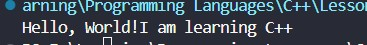
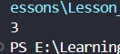
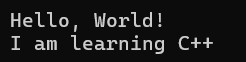
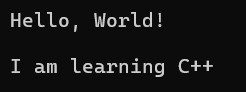
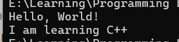

<div align="center">

# 🚀 C++ Learning Portfolio

### Building My Full Stack Development Journey, One Lesson at a Time.


<br><br>

<a href="https://github.com/mr-nexora">

</a>

<a href="https://www.linkedin.com/in/mrnexora/">

</a>

<a href="https://mr-nexora.github.io/mr-nexora-personal-portfolio/">

</a>

</div>

---

# 👋 Welcome

Welcome to my **C++ Learning Repository**.

This repository documents my complete learning journey in C++ as part of my Full Stack Development roadmap. Every lesson includes well-organized source code, explanations, screenshots, practice exercises, and mini projects to strengthen my programming, problem-solving, and object-oriented programming skills.

---

# 📂 Repository Overview

| 📌 Information | Details |
|:---------------|:--------|
| 👨‍💻 Author | **T.M.S.U. Thennakoon (Sahan Udara)** |
| 🎓 Program | Computer Science Undergraduate |
| 💻 Technology | C++ |
| 📚 Learning Method | Daily Lessons & Hands-on Practice |
| 🎯 Goal | Become a Professional Full Stack Developer |
| 📅 Repository Started | 2026 |

---

# ✨ What's Inside

- 📖 Structured Lessons
- 💻 Source Code
- 📷 Output Screenshots
- 📝 Markdown Notes
- 🚀 Mini Projects
- 📚 Practice Exercises
- 📈 Continuous Progress Updates

---

# 🌍 Connect With Me

<div align="center">

<a href="https://github.com/mr-nexora">

</a>

<a href="https://www.linkedin.com/in/mrnexora/">

</a>

<a href="https://mr-nexora.github.io/mr-nexora-personal-portfolio/">

</a>

</div>

---

# 📚 Learning Resources

This repository is built through continuous practice using educational resources such as:

- [W3Schools](https://www.w3schools.com/cpp/) 

---

# ⚖️ Copyright

> **© 2026 T.M.S.U. Thennakoon (Sahan Udara). All Rights Reserved.**
>
> This repository has been created for educational, portfolio, and personal learning purposes.
>
> You are welcome to explore this repository, learn from the code, and use the examples as a reference for your own learning and personal projects.
>If this repository helps you in your learning journey, a star ⭐ or proper credit is always appreciated.

---
<div align="center">

⭐ If you find this repository useful, consider giving it a Star.

Happy Coding! 🚀

</div>

---

# 🖥️ Lesson 03: C++ Output & New Lines

This lesson focuses on controlling console outputs in C++. You will learn how to print text and numeric configurations, along with methods to manage layout spaces using escape characters and stream manipulators.

---

## 📤 1. Standard Data Output

In C++, `cout` handles sequential data streams. By default, sequential calls to `cout` print continuous text without adding line breaks automatically.

### 📝 Printing Text
When outputting text strings, characters must be wrapped inside double quotation marks (`""`).

```CPP
    // test1.cpp
int main () {

    cout << "Hello, World!";
    cout << "I am learning C++";
    return 0;
}
```

## 

## Print Numbers
Unlike text strings, raw arithmetic digits or numerical operations do not require quotation marks.
```CPP
    // test2.cpp
    int main () {

        // Print Numbers
        cout << 3;

        return 0;
    }
```



---

# C++ New Lines
To create readable program layouts, you can separate lines using either the escape character (\n) or the stream manipulator (endl).

## Method A: Using the \n Escape Character
The newline character \n can be embedded directly inside a string literal or attached separately using insertion operators.

### Example 01: Embedded within text
```CPP
    // test3.cpp
        // Eg 01:
        cout << "Hello, World! \n";
        cout << "I am learning C++";
```



### Example 02: Appended separately
```CPP
    // test3.cpp
        // Eg 02:
        cout << "Hello, World! " << "\n";
        cout << "I am learning C++";
```


### Example 03: Generating multiple line breaks
Adding consecutive characters (\n\n) creates empty line breaks between outputs.
```CPP
    // test3.cpp
        // Eg 03:
        cout << "Hello, World! \n\n";
        cout << "I am learning C++";
```



## Method B: Using the endl Manipulator
The endl manipulator performs two actions: it moves the cursor to the next line and flushes the output buffer explicitly.

### Example 04: Standard endl execution
```CPP
    // test3.cpp
        // Eg 04:
        cout << "Hello, World! " << endl;
        cout << "I am learning C++";
```


