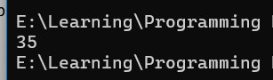
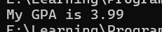
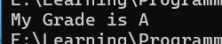
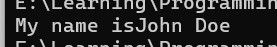
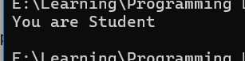
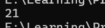
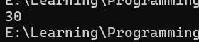
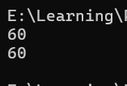
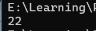

<div align="center">

# 🚀 C++ Learning Portfolio

### Building My Full Stack Development Journey, One Lesson at a Time.


<br><br>

<a href="https://github.com/mr-nexora">

</a>

<a href="https://www.linkedin.com/in/mrnexora/">

</a>

<a href="https://mr-nexora.github.io/mr-nexora-personal-portfolio/">

</a>

</div>

---

# 👋 Welcome

Welcome to my **C++ Learning Repository**.

This repository documents my complete learning journey in C++ as part of my Full Stack Development roadmap. Every lesson includes well-organized source code, explanations, screenshots, practice exercises, and mini projects to strengthen my programming, problem-solving, and object-oriented programming skills.

---

# 📂 Repository Overview

| 📌 Information | Details |
|:---------------|:--------|
| 👨‍💻 Author | **T.M.S.U. Thennakoon (Sahan Udara)** |
| 🎓 Program | Computer Science Undergraduate |
| 💻 Technology | C++ |
| 📚 Learning Method | Daily Lessons & Hands-on Practice |
| 🎯 Goal | Become a Professional Full Stack Developer |
| 📅 Repository Started | 2026 |

---

# ✨ What's Inside

- 📖 Structured Lessons
- 💻 Source Code
- 📷 Output Screenshots
- 📝 Markdown Notes
- 🚀 Mini Projects
- 📚 Practice Exercises
- 📈 Continuous Progress Updates

---

# 🌍 Connect With Me

<div align="center">

<a href="https://github.com/mr-nexora">

</a>

<a href="https://www.linkedin.com/in/mrnexora/">

</a>

<a href="https://mr-nexora.github.io/mr-nexora-personal-portfolio/">

</a>

</div>

---

# 📚 Learning Resources

This repository is built through continuous practice using educational resources such as:

- [W3Schools](https://www.w3schools.com/cpp/) 

---

# ⚖️ Copyright

> **© 2026 T.M.S.U. Thennakoon (Sahan Udara). All Rights Reserved.**
>
> This repository has been created for educational, portfolio, and personal learning purposes.
>
> You are welcome to explore this repository, learn from the code, and use the examples as a reference for your own learning and personal projects.
>If this repository helps you in your learning journey, a star ⭐ or proper credit is always appreciated.

---
<div align="center">

⭐ If you find this repository useful, consider giving it a Star.

Happy Coding! 🚀

</div>

---

# 📦 Lesson 05: C++ Variables, Identifiers & Constants

This lesson explores data storage foundational structures in C++. You will learn about built-in data types, techniques to declare single or multiple variables, assignment chains, identifier naming conventions, and protecting values using constants.

---

## 🛠️ 1. Declaring (Creating) Variables

A variable is a reserved memory location block used to store data values dynamically during program execution. To create a variable, you must specify its **type** followed by its **identifier name** and optionally assign an initial value.

### Syntax:
```cpp
type variableName = value;
🎨 2. Standard Variable Types
🔢 Integer (int)
Stores whole numbers without fractions or decimals (e.g., -15, 0, 35).


```CPP
    // test1.cpp
    int main () {

        // Int  Variable
        int myNum = 35;
        cout << myNum;

        return 0;
    }
```



---

### Double Variable
Stores fractional values containing decimal elements. Ideal for highly precise mathematical measurements.
```CPP
    // test2.cpp
    int main () {

        // Double  Variable
        double gpa = 3.99;
        cout << "My GPA is " << gpa;

        return 0;
    }
```



---

### Char Variable
Stores a single individual alphanumeric character or symbol. Character literals must be surrounded by single quotes ('')
```CPP
    // test3.cpp
    int main () {

        // Char  Variable
        char myGrade = 'A';
        cout << "My Grade is " << myGrade;

        return 0;
    }
```



---

### String Variable
Stores a sequence or array collection of characters representing literal text blocks. String values must be enclosed in double quotes ("").
```CPP
    // test4.cpp
    int main () {

        // String  Variable
        string myName = "John Doe";
        cout << "My name is" << myName;

        return 0;
    }
```



---

### Bool Variable
Stores structural states representing states that are either true (internally mapped as 1) or false (internally mapped as 0).
```CPP
    // test5.cpp
    int main () {

        // Bool  Variable
        bool isStudent = true;
        if (isStudent) {
            cout << "You are Student" <<endl;
        }
        else {
            cout << "You are NOT Student" << endl;
        }

        return 0;
    }
```



---

## 2. C++ Declare Multiple Variables

C++ allows declaration shorthand formats to create or initialize more than one variable of the exact same data type simultaneously.

### Scheme A: Declaring Many Variables (Comma-Separated)
You can declare multiple unique values inline by separating variable identifiers with commas.
```CPP
    // test6.cpp
    int main()
    {

        // Declare Many Variables
        int x = 5, y = 6, z = 10;
        cout << x + y + z;

        return 0;
    }
```

## 

### Scheme B: Assigning One Value to Multiple Variables
You can cascade assignments to bind a single common uniform scalar value to multiple independent initialized locations.
```CPP
    // test7.cpp
    int main()
    {

        // Declare Many Variables
        int x, y, z;
        x = y = z = 10;
        cout << x + y + z;

        return 0;
    }
```

## 

## 4. C++ Identifiers
All C++ variables must be uniquely identified by distinct descriptive names called Identifiers. Identifiers can be short (like m) or highly descriptive (like minutesPerHour), with descriptive naming preferred for code clarity.
```CPP
    // test8.cpp
    int main()
    {

        // C++ Identifiers
        int minutesPerHour = 60;
        int m = 60;

        cout << minutesPerHour;
        cout << m;

        return 0;
    }
```

## 

📌 Identifier Naming Rules:
- Names can contain letters, digits, and underscores (_).
-Names must begin with a letter or an underscore.
- Names are case-sensitive (myVar and myvar are completely separate allocations).
- Identifiers cannot contain whitespace spaces or special characters (!, #, %, etc.).
- C++ system keywords (like int, double, return) cannot be repurposed as identifier names.

## C++ Constants
When you prepend the const keyword to a variable declaration statement, it transforms that block allocation into a read-only property. Its value becomes unchangeable and immutable throughout program execution.

⚠️ Rule: You must assign an explicit initialization value when defining a const property line. Attempting to re-assign or modify a constant value later will trigger a compile-time error.
```CPP
    // test9.cpp
    int main()
    {

        // C++ Constants
        const int myAge = 22;
        cout << myAge;

        return 0;
    }
```


