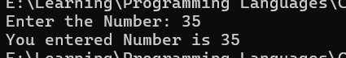

<div align="center">

# 🌐 HTML Learning Portfolio

### _For Undergraduate Computer Science Studies_

[](https://www.linkedin.com/in/mrnexora/)
[](https://github.com/mr-nexora/)

</div>

---

### 📝 Metadata & Credits

| Attribute               | Details                                                              |
| :---------------------- | :------------------------------------------------------------------- |
| **Author**              | T.M.S.U. Thennakoon (Sahan Udara)                                    |
| **Academic Context**    | Computer Science Undergraduate                                       |
| **Credits & Resources** | Inspired and learned via [W3Schools](https://www.w3schools.com/cpp/) |

> ⚠️ **Copyright Note**  
> Copyright (c) 2026 T.M.S.U. Thennakoon (Sahan Udara). All rights reserved.

---

# 📥 Lesson 06: C++ User Input

This lesson introduces interactive programming in C++ by capturing user inputs via the standard input stream. You will learn how to read data from the keyboard dynamically using `cin` and understand how it flows into variables.

---

## ⌨️ 1. Understanding `cin` and the Extraction Operator

While `cout` is used to output (print) data, **`cin`** (pronounced "see-in") is a predefined variable that reads data from the standard input device (usually the keyboard).

To read user input, `cin` is combined with the **extraction operator (`>>`)**. This operator extracts data from the input stream stream and stores it directly inside an allocated variable location.

### 💡 Dynamic Workflow Comparison:
* **Output:** `cout <<` (Data flows **out** to the screen / Insertion Operator)
* **Input:** `cin >>` (Data flows **in** from the keyboard / Extraction Operator)

---

## 💻 Code Example: Reading an Integer Input

Below is a complete implementation showing how to declare an uninitialized variable, prompt the user for data, extract the terminal input, and print it back to the console.
```CPP
    // test1.cpp
    int main()
    {

        // User Input
        int num;

        cout << "Enter the Number: ";
        cin >> num;

        cout << "You entered Number is " << num;

        return 0;
    }
```

