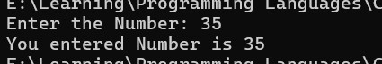

<div align="center">

# 🚀 C++ Learning Portfolio

### Building My Full Stack Development Journey, One Lesson at a Time.


<br><br>

<a href="https://github.com/mr-nexora">

</a>

<a href="https://www.linkedin.com/in/mrnexora/">

</a>

<a href="https://mr-nexora.github.io/mr-nexora-personal-portfolio/">

</a>

</div>

---

# 👋 Welcome

Welcome to my **C++ Learning Repository**.

This repository documents my complete learning journey in C++ as part of my Full Stack Development roadmap. Every lesson includes well-organized source code, explanations, screenshots, practice exercises, and mini projects to strengthen my programming, problem-solving, and object-oriented programming skills.

---

# 📂 Repository Overview

| 📌 Information | Details |
|:---------------|:--------|
| 👨‍💻 Author | **T.M.S.U. Thennakoon (Sahan Udara)** |
| 🎓 Program | Computer Science Undergraduate |
| 💻 Technology | C++ |
| 📚 Learning Method | Daily Lessons & Hands-on Practice |
| 🎯 Goal | Become a Professional Full Stack Developer |
| 📅 Repository Started | 2026 |

---

# ✨ What's Inside

- 📖 Structured Lessons
- 💻 Source Code
- 📷 Output Screenshots
- 📝 Markdown Notes
- 🚀 Mini Projects
- 📚 Practice Exercises
- 📈 Continuous Progress Updates

---

# 🌍 Connect With Me

<div align="center">

<a href="https://github.com/mr-nexora">

</a>

<a href="https://www.linkedin.com/in/mrnexora/">

</a>

<a href="https://mr-nexora.github.io/mr-nexora-personal-portfolio/">

</a>

</div>

---

# 📚 Learning Resources

This repository is built through continuous practice using educational resources such as:

- [W3Schools](https://www.w3schools.com/cpp/) 

---

# ⚖️ Copyright

> **© 2026 T.M.S.U. Thennakoon (Sahan Udara). All Rights Reserved.**
>
> This repository has been created for educational, portfolio, and personal learning purposes.
>
> You are welcome to explore this repository, learn from the code, and use the examples as a reference for your own learning and personal projects.
>If this repository helps you in your learning journey, a star ⭐ or proper credit is always appreciated.

---
<div align="center">

⭐ If you find this repository useful, consider giving it a Star.

Happy Coding! 🚀

</div>

---

# 📥 Lesson 06: C++ User Input

This lesson introduces interactive programming in C++ by capturing user inputs via the standard input stream. You will learn how to read data from the keyboard dynamically using `cin` and understand how it flows into variables.

---

## ⌨️ 1. Understanding `cin` and the Extraction Operator

While `cout` is used to output (print) data, **`cin`** (pronounced "see-in") is a predefined variable that reads data from the standard input device (usually the keyboard).

To read user input, `cin` is combined with the **extraction operator (`>>`)**. This operator extracts data from the input stream stream and stores it directly inside an allocated variable location.

### 💡 Dynamic Workflow Comparison:
* **Output:** `cout <<` (Data flows **out** to the screen / Insertion Operator)
* **Input:** `cin >>` (Data flows **in** from the keyboard / Extraction Operator)

---

## 💻 Code Example: Reading an Integer Input

Below is a complete implementation showing how to declare an uninitialized variable, prompt the user for data, extract the terminal input, and print it back to the console.
```CPP
    // test1.cpp
    int main()
    {

        // User Input
        int num;

        cout << "Enter the Number: ";
        cin >> num;

        cout << "You entered Number is " << num;

        return 0;
    }
```

