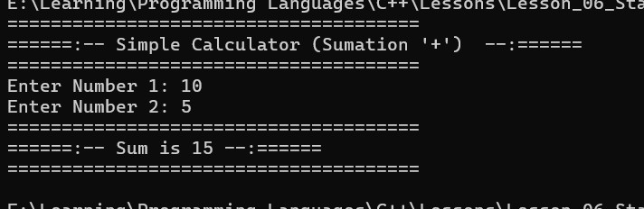
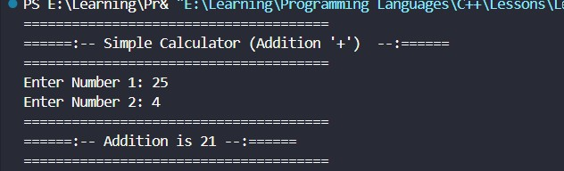
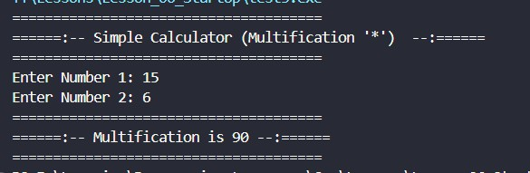
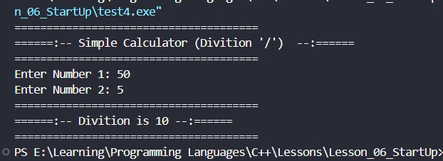
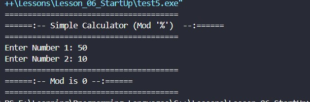

<div align="center">

# 🌐 HTML Learning Portfolio

### _For Undergraduate Computer Science Studies_

[](https://www.linkedin.com/in/mrnexora/)
[](https://github.com/mr-nexora/)

</div>

---

### 📝 Metadata & Credits

| Attribute               | Details                                                              |
| :---------------------- | :------------------------------------------------------------------- |
| **Author**              | T.M.S.U. Thennakoon (Sahan Udara)                                    |
| **Academic Context**    | Computer Science Undergraduate                                       |
| **Credits & Resources** | Inspired and learned via [W3Schools](https://www.w3schools.com/cpp/) |

> ⚠️ **Copyright Note**  
> Copyright (c) 2026 T.M.S.U. Thennakoon (Sahan Udara). All rights reserved.

---

# 🧮 Lesson 07: Simple Calculator Mini-Project

This module puts basic input/output stream management and primitive arithmetic operators into practical use. By isolating separate arithmetic logic patterns, we explore how different operators behave using integer operands.

---

## Adition Calculator

```CPP
    // test1.cpp
    #include <iostream>
    using namespace std;

    int main () {

        int x,y,sum,addition,multification,divition,mod;

        // Simple Calculator
        cout << "======================================" <<endl;
        cout << "======:-- Simple Calculator (Addition '+')  --:======" <<endl;
        cout << "======================================" <<endl;

        cout << "Enter Number 1: ";
        cin >> x;

        cout << "Enter Number 2: ";
        cin >> y;

        sum = x + y;
        
        cout << "======================================" <<endl;
        cout << "======:-- Sum is " << sum << " --:====== " <<endl;
        cout << "======================================" <<endl;

        return 0;
    }
```



---

## Subtraction Calculator

```CPP
    // test2.cpp
    #include <iostream>
    using namespace std;

    int main () {

        int x,y,sum,addition,multification,divition,mod;

        // Simple Calculator
        cout << "======================================" <<endl;
        cout << "======:-- Simple Calculator (Subtraction '-')  --:======" <<endl;
        cout << "======================================" <<endl;

        cout << "Enter Number 1: ";
        cin >> x;

        cout << "Enter Number 2: ";
        cin >> y;

        addition = x - y;
        
        cout << "======================================" <<endl;
        cout << "======:-- Addition is " << addition << " --:====== " <<endl;
        cout << "======================================" <<endl;

        return 0;
    }
```

## 

## Multiplication Calculator

```CPP
    // test3.cpp
    #include <iostream>
    using namespace std;

    int main () {

        int x,y,sum,addition,multification,divition,mod;

        // Simple Calculator
        cout << "======================================" <<endl;
        cout << "======:-- Simple Calculator (Multification '*')  --:======" <<endl;
        cout << "======================================" <<endl;

        cout << "Enter Number 1: ";
        cin >> x;

        cout << "Enter Number 2: ";
        cin >> y;

        multification = x * y;
        
        cout << "======================================" <<endl;
        cout << "======:-- Multification is " << multification << " --:====== " <<endl;
        cout << "======================================" <<endl;

        return 0;
    }
```

## 

## Division Calculator

```CPP
    // test4.cpp
    #include <iostream>
    using namespace std;

    int main () {

        int x,y,sum,addition,multification,divition,mod;

        // Simple Calculator
        cout << "======================================" <<endl;
        cout << "======:-- Simple Calculator (Divition '/')  --:======" <<endl;
        cout << "======================================" <<endl;

        cout << "Enter Number 1: ";
        cin >> x;

        cout << "Enter Number 2: ";
        cin >> y;

        divition = x / y;

        cout << "======================================" <<endl;
        cout << "======:-- Divition is " << divition << " --:====== " <<endl;
        cout << "======================================" <<endl;

        return 0;
    }
```

## 

## Modulus Calculator

```CPP
    // test5.cpp
    #include <iostream>
    using namespace std;

    int main () {

        int x,y,sum,addition,multification,divition,mod;

        // Simple Calculator
        cout << "======================================" <<endl;
        cout << "======:-- Simple Calculator (Mod '%')  --:======" <<endl;
        cout << "======================================" <<endl;

        cout << "Enter Number 1: ";
        cin >> x;

        cout << "Enter Number 2: ";
        cin >> y;

        mod = x % y;
        
        cout << "======================================" <<endl;
        cout << "======:-- Mod is " << mod << " --:====== " <<endl;
        cout << "======================================" <<endl;

        return 0;
    }
```


