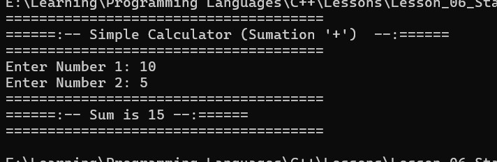
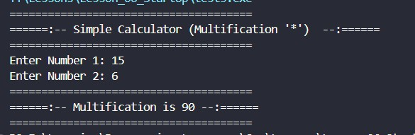
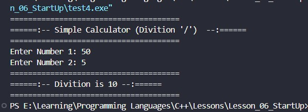

<div align="center">

# 🚀 C++ Learning Portfolio

### Building My Full Stack Development Journey, One Lesson at a Time.


<br><br>

<a href="https://github.com/mr-nexora">

</a>

<a href="https://www.linkedin.com/in/mrnexora/">

</a>

<a href="https://mr-nexora.github.io/mr-nexora-personal-portfolio/">

</a>

</div>

---

# 👋 Welcome

Welcome to my **C++ Learning Repository**.

This repository documents my complete learning journey in C++ as part of my Full Stack Development roadmap. Every lesson includes well-organized source code, explanations, screenshots, practice exercises, and mini projects to strengthen my programming, problem-solving, and object-oriented programming skills.

---

# 📂 Repository Overview

| 📌 Information | Details |
|:---------------|:--------|
| 👨‍💻 Author | **T.M.S.U. Thennakoon (Sahan Udara)** |
| 🎓 Program | Computer Science Undergraduate |
| 💻 Technology | C++ |
| 📚 Learning Method | Daily Lessons & Hands-on Practice |
| 🎯 Goal | Become a Professional Full Stack Developer |
| 📅 Repository Started | 2026 |

---

# ✨ What's Inside

- 📖 Structured Lessons
- 💻 Source Code
- 📷 Output Screenshots
- 📝 Markdown Notes
- 🚀 Mini Projects
- 📚 Practice Exercises
- 📈 Continuous Progress Updates

---

# 🌍 Connect With Me

<div align="center">

<a href="https://github.com/mr-nexora">

</a>

<a href="https://www.linkedin.com/in/mrnexora/">

</a>

<a href="https://mr-nexora.github.io/mr-nexora-personal-portfolio/">

</a>

</div>

---

# 📚 Learning Resources

This repository is built through continuous practice using educational resources such as:

- [W3Schools](https://www.w3schools.com/cpp/) 

---

# ⚖️ Copyright

> **© 2026 T.M.S.U. Thennakoon (Sahan Udara). All Rights Reserved.**
>
> This repository has been created for educational, portfolio, and personal learning purposes.
>
> You are welcome to explore this repository, learn from the code, and use the examples as a reference for your own learning and personal projects.
>If this repository helps you in your learning journey, a star ⭐ or proper credit is always appreciated.

---
<div align="center">

⭐ If you find this repository useful, consider giving it a Star.

Happy Coding! 🚀

</div>

---

# 🧮 Lesson 07: Simple Calculator Mini-Project

This module puts basic input/output stream management and primitive arithmetic operators into practical use. By isolating separate arithmetic logic patterns, we explore how different operators behave using integer operands.

---

## Adition Calculator

```CPP
    // test1.cpp
    #include <iostream>
    using namespace std;

    int main () {

        int x,y,sum,addition,multification,divition,mod;

        // Simple Calculator
        cout << "======================================" <<endl;
        cout << "======:-- Simple Calculator (Addition '+')  --:======" <<endl;
        cout << "======================================" <<endl;

        cout << "Enter Number 1: ";
        cin >> x;

        cout << "Enter Number 2: ";
        cin >> y;

        sum = x + y;
        
        cout << "======================================" <<endl;
        cout << "======:-- Sum is " << sum << " --:====== " <<endl;
        cout << "======================================" <<endl;

        return 0;
    }
```



---

## Subtraction Calculator

```CPP
    // test2.cpp
    #include <iostream>
    using namespace std;

    int main () {

        int x,y,sum,addition,multification,divition,mod;

        // Simple Calculator
        cout << "======================================" <<endl;
        cout << "======:-- Simple Calculator (Subtraction '-')  --:======" <<endl;
        cout << "======================================" <<endl;

        cout << "Enter Number 1: ";
        cin >> x;

        cout << "Enter Number 2: ";
        cin >> y;

        addition = x - y;
        
        cout << "======================================" <<endl;
        cout << "======:-- Addition is " << addition << " --:====== " <<endl;
        cout << "======================================" <<endl;

        return 0;
    }
```

## 

## Multiplication Calculator

```CPP
    // test3.cpp
    #include <iostream>
    using namespace std;

    int main () {

        int x,y,sum,addition,multification,divition,mod;

        // Simple Calculator
        cout << "======================================" <<endl;
        cout << "======:-- Simple Calculator (Multification '*')  --:======" <<endl;
        cout << "======================================" <<endl;

        cout << "Enter Number 1: ";
        cin >> x;

        cout << "Enter Number 2: ";
        cin >> y;

        multification = x * y;
        
        cout << "======================================" <<endl;
        cout << "======:-- Multification is " << multification << " --:====== " <<endl;
        cout << "======================================" <<endl;

        return 0;
    }
```

## 

## Division Calculator

```CPP
    // test4.cpp
    #include <iostream>
    using namespace std;

    int main () {

        int x,y,sum,addition,multification,divition,mod;

        // Simple Calculator
        cout << "======================================" <<endl;
        cout << "======:-- Simple Calculator (Divition '/')  --:======" <<endl;
        cout << "======================================" <<endl;

        cout << "Enter Number 1: ";
        cin >> x;

        cout << "Enter Number 2: ";
        cin >> y;

        divition = x / y;

        cout << "======================================" <<endl;
        cout << "======:-- Divition is " << divition << " --:====== " <<endl;
        cout << "======================================" <<endl;

        return 0;
    }
```

## 

## Modulus Calculator

```CPP
    // test5.cpp
    #include <iostream>
    using namespace std;

    int main () {

        int x,y,sum,addition,multification,divition,mod;

        // Simple Calculator
        cout << "======================================" <<endl;
        cout << "======:-- Simple Calculator (Mod '%')  --:======" <<endl;
        cout << "======================================" <<endl;

        cout << "Enter Number 1: ";
        cin >> x;

        cout << "Enter Number 2: ";
        cin >> y;

        mod = x % y;
        
        cout << "======================================" <<endl;
        cout << "======:-- Mod is " << mod << " --:====== " <<endl;
        cout << "======================================" <<endl;

        return 0;
    }
```


