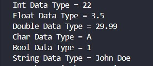
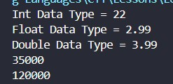
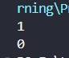
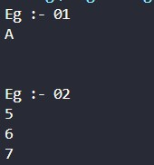
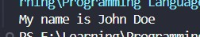
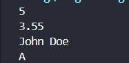

<div align="center">

# 🌐 HTML Learning Portfolio

### _For Undergraduate Computer Science Studies_

[](https://www.linkedin.com/in/mrnexora/)
[](https://github.com/mr-nexora/)

</div>

---

### 📝 Metadata & Credits

| Attribute               | Details                                                              |
| :---------------------- | :------------------------------------------------------------------- |
| **Author**              | T.M.S.U. Thennakoon (Sahan Udara)                                    |
| **Academic Context**    | Computer Science Undergraduate                                       |
| **Credits & Resources** | Inspired and learned via [W3Schools](https://www.w3schools.com/cpp/) |

> ⚠️ **Copyright Note**  
> Copyright (c) 2026 T.M.S.U. Thennakoon (Sahan Udara). All rights reserved.

---
# 🔢 Lesson 08: Deep Dive Into C++ Data Types

This lesson covers primitive data types in C++. We break down memory classification metrics, scientific float notations, ASCII mappings within characters, boolean bit representation, and automatic type inference via the modern `auto` keyword.

---

## 📊 1. Overview of C++ Primitive Data Types

Data types specify the size and type of values that a variable can store. Choosing the correct type prevents resource overhead in high-performance computing.

```CPP
    // test1.cpp
    int main () {

        // C++ Data Types
        int myAge = 22;
        float myGPA = 3.5;
        double myNum = 29.99;
        char myLetter = 'A';
        bool isStudent = true;
        string myName = "John Doe";

        cout << myAge <<endl;
        cout << myGPA <<endl;
        cout << myNum <<endl;
        cout << myLetter <<endl;
        cout << isStudent <<endl;
        cout << myName <<endl;

        return 0;
    }
```



---

## Numeric Data Types

C++ distinguishes integers from floating-point properties. It also supports Scientific E-Notations to declare exponents of base 10.

| Data Type | Keyword | Size (Bytes) | Precision / Range | Example Usage |
| :--- | :--- | :--- | :--- | :--- |
| **Integer** | `int` | 4 bytes | Whole numbers from -2,147,483,648 to 2,147,483,648 | `int myAge = 22;` |
| **Floating-Point** | `float` | 4 bytes | Sufficient for storing 6 to 7 decimal digits | `float myNum = 2.99f;` |
| **Double Floating-Point** | `double` | 8 bytes | Sufficient for storing up to 15 decimal digits | `double myNUM = 3.99;` |
| **Scientific Notation (Float)** | `float` | 4 bytes | Power of 10 (`e` or `E`) | `float x = 35e3;` *(35000)* |
| **Scientific Notation (Double)** | `double` | 8 bytes | Power of 10 (`e` or `E`) with higher precision | `double y = 12E4;` *(120000)* |
```CPP
    // test2.cpp
    int main()
    {
        // Int Data Types
        int myAge = 22;
        cout << "Int Data Type = " << myAge << endl;

        // Float Data Types
        float myNum = 2.99;
        cout << "Float Data Type = " << myNum << endl;

        // Double Data Types
        double myNUM = 3.99;
        cout << "Double Data Type = " << myNUM << endl;

        // Scientific Numbers
        float x = 35e3;
        double y = 12E4;

        cout << x << endl;
        cout << y << endl;

        return 0;
    }
```

## 

## Boolean Data Types
A boolean data type is declared with the bool keyword and can only take the values true or false. Internally, the compiler stores true as 1 and false as 0 when evaluated on output logs.
```CPP
    // test3.cpp
    int main () {

        // Boolean Data Types
        bool isStudent = true;
        bool eatFish = false;

        cout << isStudent <<endl; // Output is 1 (True)
        cout << eatFish <<endl; // Output is 0 (False)

        return 0;
    }
```

## 

## Character Data Types
The char data type is used to store a single character surrounded by single quotes. Alternatively, you can use raw integer numbers matching ASCII (American Standard Code for Information Interchange) protocols to dynamically display characters.
```CPP
    // test4.cpp
    int main () {

        // Character Data Types
        cout << "Eg :- 01 \n";
        char myGrade = 'A';
        cout << myGrade <<endl;


        cout << "\n\nEg :- 02 \n";
        char a=65, b=66, c=67;
        cout << a <<endl;
        cout << b <<endl;
        cout << c <<endl;

        return 0;
    }
```

## 

## String Data Types
Strings represent structured character blocks wrapped in double quotes. To unlock string features smoothly, ensure standard configuration streams are preserved.
```CPP
    // test5.cpp
    int main () {

        // String Data Type
        string name = "John Doe";
        cout << "My name is " << name;

        return 0;
    }
```

## 

## The auto Keyword
Introduced in modern C++ (C++11 and onwards), the auto keyword instructs the compiler to automatically deduce the exact data type of a variable at compile time based on its initialization value.

⚠️ Rule: Variables declared with auto must be initialized immediately upon declaration so the compiler can determine their type.
```CPP
    // test6.cpp
    int main () {

        // The auto Keyword
        auto x = 5;
        auto y = 3.55;
        auto name = "John Doe";
        auto grade = 'A';

        cout << x <<endl;
        cout << y <<endl;
        cout << name <<endl;
        cout << grade <<endl;

        return 0;
    }
```


