<div align="center">

# 🌐 HTML Learning Portfolio

### _For Undergraduate Computer Science Studies_

[](https://www.linkedin.com/in/mrnexora/)
[](https://github.com/mr-nexora/)

</div>

---

### 📝 Metadata & Credits

| Attribute               | Details                                                              |
| :---------------------- | :------------------------------------------------------------------- |
| **Author**              | T.M.S.U. Thennakoon (Sahan Udara)                                    |
| **Academic Context**    | Computer Science Undergraduate                                       |
| **Credits & Resources** | Inspired and learned via [W3Schools](https://www.w3schools.com/cpp/) |

> ⚠️ **Copyright Note**  
> Copyright (c) 2026 T.M.S.U. Thennakoon (Sahan Udara). All rights reserved.

---

# ⚙️ Lesson 09: C++ Operators & Precedence Rules

This module breaks down data execution operations in C++. We explore standard arithmetic, compound assignments, bitwise shifting masks, comparisons tracking boolean evaluations, logical branching operators, and compiler precedence rules.

---

## ➕ 1. Arithmetic Operators

Arithmetic operators perform standard mathematical calculations on numerical operands.

### 🔹 Core Math Operations (`+`, `-`, `*`, `/`, `%`

### Addition

```CPP
    // test1.cpp

int x = 10, y = 5;
cout << "Addition = " << x + y;
```

## 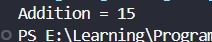

---

### Subtraction

```CPP
    // test2.cpp
int x = 10, y = 5;
cout << "Subtraction = " << x - y;
```

## 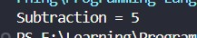

---

### Multiplication

```CPP
    // test3.cpp
int x = 10, y = 5;
cout << "Multiplication = " << x * y;
```

## 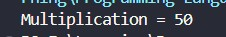

---

### Division

```CPP
    // test4.cpp
int x = 10, y = 5;
cout << "Division = " << x / y;
```

## 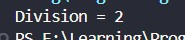

---

### Modulus

```CPP
    // test5.cpp
int x = 10, y = 5;
cout << "Modulus = " << x % y;
```

## 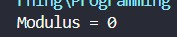

---

### Increment

```CPP
    // test6.cpp
int x = 5;
int y = 5;

// Pre-Increment (++a)
cout << "Pre-Increment (++x) Value: " << ++x << endl;
cout << "Now value of x: " << x << endl << endl;

// Post-Increment (y++)
cout << "Post-Increment (y++) value: " << y++ << endl;
cout << "Now value of y: " << y << endl;
```

## 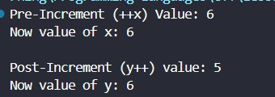

---

### Decrement

```CPP
    // test7.cpp
int x = 10;
int y = 10;

// Pre-Decrement (--x)
cout << "Pre-Decrement (--x) value: " << --x << endl;
cout << "Now x Value: " << x << endl << endl;

// Post-Decrement (y--)
cout << "Post-Decrement (y--) value: " << y-- << endl;
cout << "Now y value: " << y << endl;
```

## 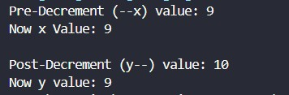

---

## Assignment operators
Assignment operators assign values to variables. Compound operators combine an arithmetic operation with an assignment shorthand.
### = Operator

```CPP
    int x = 10;
    cout << "x = " << x << endl; // x = 10
    cout << "\n\n\n";
```

## 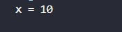

---

### += Operator

```CPP
    int x = 10;
    x += 6;                            // x = 10 + 6
    cout << "x += 6 -> " << x << endl; // x = 16
```

## 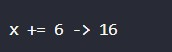

---

### -= Operator

```CPP
    int x = 16;
    x -= 4;                            // x = 16 - 4
    cout << "x -= 4 -> " << x << endl; // x = 12

```

## 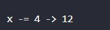

---

### \*= Operator

```CPP
    int x = 12;
    x *= 2;                            // x = 12 * 2
    cout << "x *= 2 -> " << x << endl; // x = 24

```

## 

---

### /= Operator

```CPP
    int x = 24;
    x /= 3;                            // x = 24 / 3
    cout << "x /= 3 -> " << x << endl; // x = 8

```

## 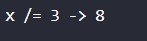

---

### %= Operator

```CPP
    int x = 8;
    x %= 5;                            // x = 8 % 5
    cout << "x %= 5 -> " << x << endl; // x = 3

```

## 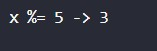

---

### Bitwise Assignment Operators
These perform compound assignments directly on the binary representation of integers.
### &= Operator

```CPP
    int x = 3;
    x &= 7;                            // 0011 & 0111
    cout << "x &= 7 -> " << x << endl; // x = 3

```

## 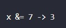

---

### |= Operator

```CPP
    int x = 3;
    x |= 4;                            // 0011 | 0100
    cout << "x |= 4 -> " << x << endl; // x = 7 (Binary: 0111)

```

## 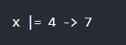

---

### ^= Operator

```CPP
    int x = 7;
    x ^= 2;                            // 0111 ^ 0010
    cout << "x ^= 2 -> " << x << endl; // x = 5 (Binary: 0101)

```

## 

---

### >>= Operator

```CPP
    int x = 5;
    x >>= 1;                            // Shifting the value 0101 to the right by 1
    cout << "x >>= 1 -> " << x << endl; // x = 2 (Binary: 0010)

```

## 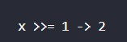

---

### <<= Operator

```CPP
    int x = 2;
    x <<= 3;                            // Shifting the value 0010 to the left by 3
    cout << "x <<= 3 -> " << x << endl; // x = 16 (Binary: 10000)
```

## 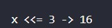

---

## Comparison operators
Comparison operators compare two values and return a boolean output: 1 (True) or 0 (False).
### Equal to x == y

```CPP
        int x = 5;
        int y = 10;
        cout << (x == y) << endl; // Output: 0 (False)
        cout << "\n\n";
```

## 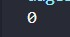

---

### Not equal x != y

```CPP
        int x = 5;
        int y = 10;
        cout << (x != y) << endl; // Output: 1 (True)
        cout << "\n\n";
```

## 

---

### Greater than x > y

```CPP
        int x = 5;
        int y = 10;
        cout << (x > y) << endl; // Output: 0 (False)
        cout << "\n\n";
```

## 

---

### Less than x < y

```CPP
        int x = 5;
        int y = 10;
        cout << (x < y) << endl; // Output: 1 (True)
        cout << "\n\n";
```

## 

---

### Greater than or equal to x >= y

```CPP
        int x = 5;
        int y = 10;
        cout << (x >= y) << endl; // Output: 0 (False)
        cout << "\n\n";
```

## 

---

### Less than or equal to x <= y

```CPP
        int x = 5;
        int y = 10;
        cout << (x <= y) << endl; // Output: 1 (True)
```

## 

---

## Logical operators
Logical operators are used to determine the logic between variables or values, commonly used to combine multiple conditions.
### Logical and

```CPP
    int x = 5;

    int p = x > 4 && x <10 ;
    cout << "Output = " << p <<endl;
```

## 

---

### Logical or

```CPP
    int x = 5;

    int q = x > 4 || x <10 ;
    cout << "Output = " << q <<endl;

```

## 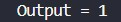

---

### Logical not

```CPP
    int x = 5;

    int r = !(x > 4 && x <10) ;
    cout << "Output = " << r <<endl;
```

## 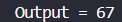

---

## Bitwise operators

```CPP
    // Example 1: Multiplication has higher precedence than addition
    int result1 = 5 + 3 * 2;
    // Step 1: 3 * 2 = 6
    // Step 2: 5 + 6 = 11
    cout << "Example 1 (5 + 3 * 2) = " << result1 << endl;
```

## 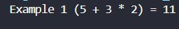

---

```CPP
    // Example 2: Parentheses () have the highest precedence
    int result2 = (5 + 3) * 2;
    // Step 1: (5 + 3) = 8
    // Step 2: 8 * 2 = 16
    cout << "Example 2 ((5 + 3) * 2) = " << result2 << endl;
```

## 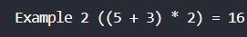

---

```CPP
    // Example 3: Same precedence operators execute from Left-to-Right (Associativity)
    int result3 = 20 / 4 * 2;
    // Step 1: 20 / 4 = 5
    // Step 2: 5 * 2 = 10
    cout << "Example 3 (20 / 4 * 2) = " << result3 << endl;
```

## 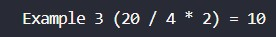

---

```CPP
    // Example 4: Complex expression combining multiple rules
    int result4 = 10 + 40 / (2 * 2) - 3;
    // Step 1 (Parentheses): 2 * 2 = 4 -> (10 + 40 / 4 - 3)
    // Step 2 (Division): 40 / 4 = 10 -> (10 + 10 - 3)
    // Step 3 (Left-to-Right): 10 + 10 = 20 -> (20 - 3)
    // Step 4 (Subtraction): 20 - 3 = 17
    cout << "Example 4 (10 + 40 / (2 * 2) - 3) = " << result4 << endl;
```

## 

---
