<div align="center">

# 🌐 HTML Learning Portfolio

### _For Undergraduate Computer Science Studies_

[](https://www.linkedin.com/in/mrnexora/)
[](https://github.com/mr-nexora/)

</div>

---

### 📝 Metadata & Credits

| Attribute               | Details                                                              |
| :---------------------- | :------------------------------------------------------------------- |
| **Author**              | T.M.S.U. Thennakoon (Sahan Udara)                                    |
| **Academic Context**    | Computer Science Undergraduate                                       |
| **Credits & Resources** | Inspired and learned via [W3Schools](https://www.w3schools.com/cpp/) |

> ⚠️ **Copyright Note**  
> Copyright (c) 2026 T.M.S.U. Thennakoon (Sahan Udara). All rights reserved.

---

# 🔤 Lesson 10: C++ Strings Manipulation & Functions

This lesson covers text processing architecture in C++. We explore standard declarations, concatenation syntax, utility functions for manipulation, and methods like `getline()` to resolve stream delimitation issues during user input extraction.

---

## 📌 1. Basic Standard Strings & Concatenation

Strings are objects that represent sequences of characters. To join two strings sequentially, C++ provides the simple operators (`+`).

### 🔹 Basic Initialization

```CPP
    // test1.cpp
    string greeting = "Hello";
    cout << greeting;
```

## 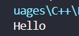

---

## String Concatenation

```CPP
    // test2.cpp
    string firstName = "John";
    string lastName = "Doe";

    string fullName = firstName + " " + lastName;
    cout << fullName;
```

## 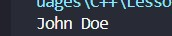

---

## String Functions

### Capacity & Size

#### length() / size()
Both functions return the total count of characters embedded inside the string sequence. They are identical in execution functionality.
```CPP
    // test3.cpp
    string text = "Hello";
    cout << text.length(); // Output: 5
```

## 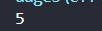

---

#### empty()
Returns a boolean value (true/1 or false/0) verifying whether a string contains zero data.
```CPP
    // test4.cpp
    string text = "";

    if (text.empty())
    {
        cout << "String is empty"; // This will print
    }
```

## 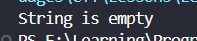

---

### Element Access & Search

#### at()
Returns the specific character located at a given index boundary parameter. Indexes begin sequentially at 0.
```CPP
    // test5.cpp
    string text = "Ceylon";
    cout << text.at(2); // Output: y
```

## 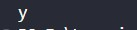

---

#### find()
Searches for a specific substring inside the source variable and returns the starting index of its first occurrence.
```CPP
    // test6.cpp
    string text = "I love C++ coding";
    int index = text.find("C++");
    cout << index; // Output: 7
```

## 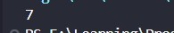

---

### Modification & Substrings

#### append()
Appends another string sequence directly onto the end of the existing text block structure.
```CPP
    // test7.cpp
    string text = "Sri ";
    text.append("Lanka");
    cout << text; // Output: Sri Lanka
```

## 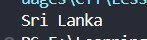

---

#### push_back()
Appends a single individual character literal onto the absolute end boundary point.
```CPP
    // test8.cpp
    string text = "Car";
    text.push_back('s');
    cout << text; // Output: Cars
```

## 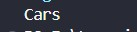

---

#### pop_back()
Removes the absolute final character element from the end of the string block.
```CPP
    // test9.cpp
    string text = "Apple";
    text.pop_back();
    cout << text; // Output: Appl
```

## 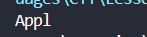

---

#### substr()
Extracts a specific segment from a string. It requires two arguments: substr(starting_index, length_of_segment).
```CPP
    // test10.cpp
    string text = "Banana";
    string small = text.substr(2, 4);
    cout << small; // Output: nana
```

## 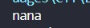

---

#### erase()
Deletes a defined chunk of text from the source sequence: erase(starting_index, element_count).
```CPP
    // test11.cpp
    string text = "ABC123XYZ";
    text.erase(3, 3); // Removes "123"
    cout << text;     // Output: ABCXYZ
```

## 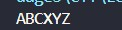

---

#### replace()
Replaces a specified portion of a string with a new text block: replace(starting_index, length, new_string).
```CPP
    // test12.cpp
    string text = "I have a dog";
    text.replace(9, 3, "cat");
    cout << text; // Output: I have a cat
```

## 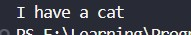

---

#### clear()
Wipes out all stored text character items from the memory variable string block instantly, dropping its final allocation size down to zero.
```CPP
    // test13.cpp
    string text = "Welcome";
    text.clear();
    cout << "Size is: " << text.size(); // Output: Size is: 0
```

## 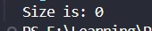

---

### Comparison

#### compare()
Compares two strings lexicographically. It returns 0 if both are identical, a value less than 0 if the first string is lexicographically smaller, or greater than 0 if it is larger.
```CPP
    // test14.cpp
    string str1 = "Apple";
    string str2 = "Apple";

    if (str1.compare(str2) == 0)
    {
        std::cout << "Both strings match"; // This will print
    }
```

## 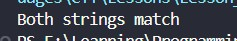

---

## Capturing User Inputs: Resolving Whitespace Breaks
As introduced in prior input modules, the standard extraction mechanism cin >> stops reading when it encounters whitespace. To read a full line of text with spaces safely, use the getline() function.

### The Problem with cin >>
If you pass "John Doe", cin >> will truncate data at the first space block, reading only "John".

### The Solution: Using getline()
The getline(cin, stringVariable) function reads the entire input stream line continuously until the user presses Enter.
```CPP
    // test15.cpp   
/* 
     C++ User Input Strings
     string fullName;

     cout << "Enter your Full Name: ";
     cin >> fullName;

     cout << "Your name is: " << fullName;

    // Enter Full Name = John Doe
    // Your name is: John

 */
    // Fix this
    string fullName;

    cout << "Enter your Full Name: ";
    getline(cin,fullName);

    cout << "Your name is: " << fullName;

    // Enter Full Name = John Doe
    // Your name is: John Doe
```

## 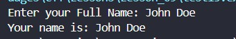

---
