<div align="center">

# 🌐 HTML Learning Portfolio

### _For Undergraduate Computer Science Studies_

[](https://www.linkedin.com/in/mrnexora/)
[](https://github.com/mr-nexora/)

</div>

---

### 📝 Metadata & Credits

| Attribute               | Details                                                              |
| :---------------------- | :------------------------------------------------------------------- |
| **Author**              | T.M.S.U. Thennakoon (Sahan Udara)                                    |
| **Academic Context**    | Computer Science Undergraduate                                       |
| **Credits & Resources** | Inspired and learned via [W3Schools](https://www.w3schools.com/cpp/) |

> ⚠️ **Copyright Note**  
> Copyright (c) 2026 T.M.S.U. Thennakoon (Sahan Udara). All rights reserved.

---

# 🧮 Lesson 11: C++ Math Operators & `<cmath>` Library

This lesson explores algorithmic computation properties in C++. We cover basic comparison helper features (`max`/`min`) alongside complex mathematical operations unlocked via the standard standard library headers.

---

## 🔍 1. Basic Comparisons: `max()` and `min()`

The `max()` and `min()` functions are available in the standard algorithm/utility pool by default. They allow you to easily find the highest or lowest values between two compared terms.

### 🔺 Maximum Value
```CPP
    // test1.cpp
    int x = 5, y =10;

    int MAX = max(x,y);
    cout << "Max Value: " << MAX;
```

## 

---

## 🔻 Minimum Value

```CPP
    // test1.cpp
    int x = 5, y =10;

    int MIN = min(x,y);
    cout << "Min Value: " << MIN;
```

## 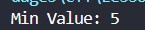

---

## C++ <cmath> Library
To access advanced algebraic, trigonometric, and rounding structures, you must include the standard header package: #include <cmath>.

## Math Functions

### Basic & Power Operations

#### sqrt: Finds the square root of a number

```CPP
    cout << "sqrt value: " << sqrt(25); // Output: 5
```

## 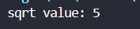

---

#### cbrt: Finds the cube root of a number

```CPP
    cout << "cbrt value: " << cbrt(27); // Output: 3
```

## 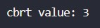

---

#### pow: Raises the base to the power of exponent (2 cubed)

```CPP
    cout << "pow value: " << pow(2, 3); // Output: 8
```

## 

---

#### abs: Converts negative numbers into positive numbers

```CPP
    cout << "abs value: " << abs(-15); // Output: 15
```

## 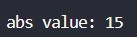

---

#### fmod: Finds the remainder of a decimal division (5.5 / 2)

```CPP
    cout << "fmod value: " << fmod(5.5, 2.0); // Output: 1.5
```

## 

---

### Rounding & Estimation

#### round: Rounds to the nearest whole number

```CPP
    cout << "round value: " << round(4.6) << endl; // Output: 5
    cout << "round value: " << round(4.3);         // Output: 4
```

## 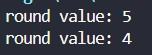

---

#### ceil: Always rounds upwards to the next integer

```CPP
    cout << "ceil value: " << ceil(4.1); // Output: 5
```

## 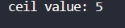

---

#### floor: Always rounds downwards to the previous integer

```CPP
    cout << "floor value: " << floor(4.9); // Output: 4
```

## 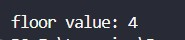

---

### Logarithmic & Exponential

#### exp: Calculates e raised to the power of x (e^1)

```CPP
    cout << "exp value: " << exp(1); // Output: 2.71828
```

## 

---

#### log: Calculates the natural logarithm (base-e)

```CPP
    cout << "log value: " << log(2.71828); // Output: 1
```

## 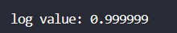

---

#### log10: Calculates the common logarithm (base-10)

```CPP
    cout << "log value: " << log10(100); // Output: 2
```

## 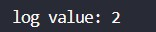

---

#### log2: Calculates the binary logarithm (base-2)

```CPP
    cout << "log value: " << log2(8); // Output: 3
```

## 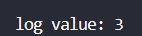

---

### Trigonometric Functions

#### sin: Calculates the sine of an angle (input must be in radians)

```CPP
    cout << "sin value: " << sin(1.5708); // Output: 1 (approx for 90 degrees)
```

## 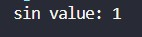

---

#### cos: Calculates the cosine of an angle in radians

```CPP
    cout << "cos value: " << cos(0); // Output: 1
```

## 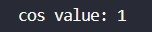

---

#### tan: Calculates the tangent of an angle in radians

```CPP
    cout << "tan value: " << tan(0.7854); // Output: 1 (approx for 45 degrees)
```

## 
