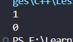
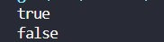
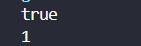
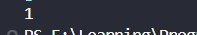

<div align="center">

# 🌐 HTML Learning Portfolio

### _For Undergraduate Computer Science Studies_

[](https://www.linkedin.com/in/mrnexora/)
[](https://github.com/mr-nexora/)

</div>

---

### 📝 Metadata & Credits

| Attribute               | Details                                                              |
| :---------------------- | :------------------------------------------------------------------- |
| **Author**              | T.M.S.U. Thennakoon (Sahan Udara)                                    |
| **Academic Context**    | Computer Science Undergraduate                                       |
| **Credits & Resources** | Inspired and learned via [W3Schools](https://www.w3schools.com/cpp/) |

> ⚠️ **Copyright Note**  
> Copyright (c) 2026 T.M.S.U. Thennakoon (Sahan Udara). All rights reserved.

---

Elakirima! Lesson 12 eka thiyenne C++ Booleans handling saha output formatting (boolalpha, noboolalpha) ekka booleans expressions variable ekaka store karaganne kohomada කියන එක ගැන.

Oya deepu concepts tika clean visual hierarchy ekakatayi, formatting rules text ekakatayi pahasuwen galapala README.md file eka sakas kala. Hama path ekakatama oya deepu images (img1.jpg sita img5.jpg dhakwa) adala thanwala thiyala thiyenne.

Me thiyenne oyage Lesson 12: C++ Booleans README.md file eka:

Markdown
<div align="center">

# 🌐 C++ Learning Portfolio
### *For Undergraduate Computer Science Studies*

[](https://www.linkedin.com/in/mrnexora/)
[](https://github.com/mr-nexora/)

</div>

---
# ⚖️ Lesson 12: C++ Booleans & Stream Manipulators

This lesson explores logical truth states in C++. We cover basic boolean values, how to control console output formatting using the `boolalpha` and `noboolalpha` stream manipulators, and techniques for processing and storing boolean expression evaluations.

---

## 1. Basic Boolean Outputs (Binary Representation)

A `bool` data type holds one of two literal values: `true` or `false`. By default, when printing boolean types, the C++ standard output stream maps `true` directly to **`1`** and `false` to **`0`**.

```CPP
    // test1.cpp
    bool isStudent = true;
    bool isStudyMaths = false;

    cout << isStudent << endl;    // Output is 1 (True)
    cout << isStudyMaths << endl; // Output is 0 (False)
```

## 

---

## 2. Formatting Output Strings: boolalpha & noboolalpha
To switch from numerical representations to explicit text layouts within your console logs, C++ provides stream manipulators to adjust terminal outputs.

### Method A: Enabling Textual Outputs with boolalpha
Inserting boolalpha into the standard output chain instructs the stream to display text strings ("true" / "false") instead of raw binary digits.
```CPP
    // test2.cpp
    bool isStudent = true;
    bool isStudyMaths = false;

    cout << boolalpha; // enable printing "true"/"false"

    cout << isStudent << endl;    // Outputs true
    cout << isStudyMaths << endl; // Outputs false
```

## 

---

### Method B: Resetting to Default with noboolalpha
To undo changes made by boolalpha and switch back to numeric output (1/0), add the noboolalpha manipulator back into your output sequence.
```CPP
    // test3.cpp
    bool isStudent = true;

    cout << boolalpha;         // print as true/false
    cout << isStudent << endl; // Outputs true

    cout << noboolalpha;       // reset cout back to printing 1/0
    cout << isStudent << endl; // Outputs 1
```

## 

---

## 3. Processing Boolean Expressions
A boolean expression evaluates comparison inputs and resolves them into a single final boolean state result.
```CPP
    // test4.cpp
    // Eg 01:
    int x = 10, y = 5;
    cout << (x > y) << "\n\n"; // Output is 1 (True)
    cout << (y > x) << "\n\n"; // Output is 0 (False)

    // Eg 02:
    int z  = 10;
    cout << (z == 10);
```

## 

---

## 4. Storing Expression Results in Variables
Instead of printing expressions immediately, you can compute comparative operations beforehand and save their structural logic state inside a allocated bool memory location for later execution checks.
```CPP
    // test5.cpp
    int x = 10, y = 5;

    bool isGreater = x > y;
    cout << isGreater; // Output is 1 (True)
```

## 

---
