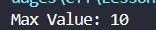
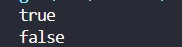
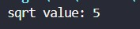
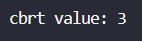
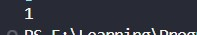

<div align="center">

# 🚀 C++ Learning Portfolio

### Building My Full Stack Development Journey, One Lesson at a Time.


<br><br>

<a href="https://github.com/mr-nexora">

</a>

<a href="https://www.linkedin.com/in/mrnexora/">

</a>

<a href="https://mr-nexora.github.io/mr-nexora-personal-portfolio/">

</a>

</div>

---

# 👋 Welcome

Welcome to my **C++ Learning Repository**.

This repository documents my complete learning journey in C++ as part of my Full Stack Development roadmap. Every lesson includes well-organized source code, explanations, screenshots, practice exercises, and mini projects to strengthen my programming, problem-solving, and object-oriented programming skills.

---

# 📂 Repository Overview

| 📌 Information | Details |
|:---------------|:--------|
| 👨‍💻 Author | **T.M.S.U. Thennakoon (Sahan Udara)** |
| 🎓 Program | Computer Science Undergraduate |
| 💻 Technology | C++ |
| 📚 Learning Method | Daily Lessons & Hands-on Practice |
| 🎯 Goal | Become a Professional Full Stack Developer |
| 📅 Repository Started | 2026 |

---

# ✨ What's Inside

- 📖 Structured Lessons
- 💻 Source Code
- 📷 Output Screenshots
- 📝 Markdown Notes
- 🚀 Mini Projects
- 📚 Practice Exercises
- 📈 Continuous Progress Updates

---

# 🌍 Connect With Me

<div align="center">

<a href="https://github.com/mr-nexora">

</a>

<a href="https://www.linkedin.com/in/mrnexora/">

</a>

<a href="https://mr-nexora.github.io/mr-nexora-personal-portfolio/">

</a>

</div>

---

# 📚 Learning Resources

This repository is built through continuous practice using educational resources such as:

- [W3Schools](https://www.w3schools.com/cpp/) 

---

# ⚖️ Copyright

> **© 2026 T.M.S.U. Thennakoon (Sahan Udara). All Rights Reserved.**
>
> This repository has been created for educational, portfolio, and personal learning purposes.
>
> You are welcome to explore this repository, learn from the code, and use the examples as a reference for your own learning and personal projects.
>If this repository helps you in your learning journey, a star ⭐ or proper credit is always appreciated.

---
<div align="center">

⭐ If you find this repository useful, consider giving it a Star.

Happy Coding! 🚀

</div>

---

Elakirima! Lesson 12 eka thiyenne C++ Booleans handling saha output formatting (boolalpha, noboolalpha) ekka booleans expressions variable ekaka store karaganne kohomada කියන එක ගැන.

Oya deepu concepts tika clean visual hierarchy ekakatayi, formatting rules text ekakatayi pahasuwen galapala README.md file eka sakas kala. Hama path ekakatama oya deepu images (img1.jpg sita img5.jpg dhakwa) adala thanwala thiyala thiyenne.

Me thiyenne oyage Lesson 12: C++ Booleans README.md file eka:

Markdown
<div align="center">

# 🌐 C++ Learning Portfolio
### *For Undergraduate Computer Science Studies*

[](https://www.linkedin.com/in/mrnexora/)
[](https://github.com/mr-nexora/)

</div>

---
# ⚖️ Lesson 12: C++ Booleans & Stream Manipulators

This lesson explores logical truth states in C++. We cover basic boolean values, how to control console output formatting using the `boolalpha` and `noboolalpha` stream manipulators, and techniques for processing and storing boolean expression evaluations.

---

## 1. Basic Boolean Outputs (Binary Representation)

A `bool` data type holds one of two literal values: `true` or `false`. By default, when printing boolean types, the C++ standard output stream maps `true` directly to **`1`** and `false` to **`0`**.

```CPP
    // test1.cpp
    bool isStudent = true;
    bool isStudyMaths = false;

    cout << isStudent << endl;    // Output is 1 (True)
    cout << isStudyMaths << endl; // Output is 0 (False)
```

## 

---

## 2. Formatting Output Strings: boolalpha & noboolalpha
To switch from numerical representations to explicit text layouts within your console logs, C++ provides stream manipulators to adjust terminal outputs.

### Method A: Enabling Textual Outputs with boolalpha
Inserting boolalpha into the standard output chain instructs the stream to display text strings ("true" / "false") instead of raw binary digits.
```CPP
    // test2.cpp
    bool isStudent = true;
    bool isStudyMaths = false;

    cout << boolalpha; // enable printing "true"/"false"

    cout << isStudent << endl;    // Outputs true
    cout << isStudyMaths << endl; // Outputs false
```

## 

---

### Method B: Resetting to Default with noboolalpha
To undo changes made by boolalpha and switch back to numeric output (1/0), add the noboolalpha manipulator back into your output sequence.
```CPP
    // test3.cpp
    bool isStudent = true;

    cout << boolalpha;         // print as true/false
    cout << isStudent << endl; // Outputs true

    cout << noboolalpha;       // reset cout back to printing 1/0
    cout << isStudent << endl; // Outputs 1
```

## 

---

## 3. Processing Boolean Expressions
A boolean expression evaluates comparison inputs and resolves them into a single final boolean state result.
```CPP
    // test4.cpp
    // Eg 01:
    int x = 10, y = 5;
    cout << (x > y) << "\n\n"; // Output is 1 (True)
    cout << (y > x) << "\n\n"; // Output is 0 (False)

    // Eg 02:
    int z  = 10;
    cout << (z == 10);
```

## 

---

## 4. Storing Expression Results in Variables
Instead of printing expressions immediately, you can compute comparative operations beforehand and save their structural logic state inside a allocated bool memory location for later execution checks.
```CPP
    // test5.cpp
    int x = 10, y = 5;

    bool isGreater = x > y;
    cout << isGreater; // Output is 1 (True)
```

## 

---
