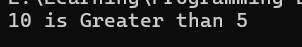
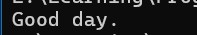
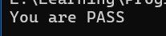
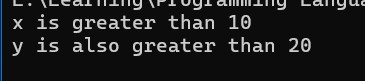
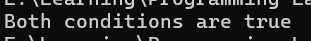
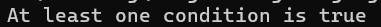

<div align="center">

# 🚀 C++ Learning Portfolio

### Building My Full Stack Development Journey, One Lesson at a Time.


<br><br>

<a href="https://github.com/mr-nexora">

</a>

<a href="https://www.linkedin.com/in/mrnexora/">

</a>

<a href="https://mr-nexora.github.io/mr-nexora-personal-portfolio/">

</a>

</div>

---

# 👋 Welcome

Welcome to my **C++ Learning Repository**.

This repository documents my complete learning journey in C++ as part of my Full Stack Development roadmap. Every lesson includes well-organized source code, explanations, screenshots, practice exercises, and mini projects to strengthen my programming, problem-solving, and object-oriented programming skills.

---

# 📂 Repository Overview

| 📌 Information | Details |
|:---------------|:--------|
| 👨‍💻 Author | **T.M.S.U. Thennakoon (Sahan Udara)** |
| 🎓 Program | Computer Science Undergraduate |
| 💻 Technology | C++ |
| 📚 Learning Method | Daily Lessons & Hands-on Practice |
| 🎯 Goal | Become a Professional Full Stack Developer |
| 📅 Repository Started | 2026 |

---

# ✨ What's Inside

- 📖 Structured Lessons
- 💻 Source Code
- 📷 Output Screenshots
- 📝 Markdown Notes
- 🚀 Mini Projects
- 📚 Practice Exercises
- 📈 Continuous Progress Updates

---

# 🌍 Connect With Me

<div align="center">

<a href="https://github.com/mr-nexora">

</a>

<a href="https://www.linkedin.com/in/mrnexora/">

</a>

<a href="https://mr-nexora.github.io/mr-nexora-personal-portfolio/">

</a>

</div>

---

# 📚 Learning Resources

This repository is built through continuous practice using educational resources such as:

- [W3Schools](https://www.w3schools.com/cpp/) 

---

# ⚖️ Copyright

> **© 2026 T.M.S.U. Thennakoon (Sahan Udara). All Rights Reserved.**
>
> This repository has been created for educational, portfolio, and personal learning purposes.
>
> You are welcome to explore this repository, learn from the code, and use the examples as a reference for your own learning and personal projects.
>If this repository helps you in your learning journey, a star ⭐ or proper credit is always appreciated.

---
<div align="center">

⭐ If you find this repository useful, consider giving it a Star.

Happy Coding! 🚀

</div>

---

# 🔀 Lesson 13: C++ Conditional Branching (If...Else)

This lesson explores program control flow in C++. You will master standard conditional execution statements, logic encapsulation inside boolean variables, nested evaluation structures, short-hand conditional expressions (Ternary Operator), and multi-condition parsing using logical operators.

---

## 🛑 1. The `if` Statement

The `if` block executes a target block of code only if its underlying relational expression evaluates to **`true`** (`1`).

### 🔹 Scheme A: Direct Expression Checks

```CPP
    // test1.cpp
    int x  = 10, y = 5;

    if (x > y) {
        cout << x << " is Greater than " << y <<endl;
    }
```

## 

---

### 🔹 Scheme B: Evaluating a Pre-computed Boolean Property

```CPP
    // test2.cpp
    int x = 15, y = 25;
    bool isGreater = x < y;

    if (isGreater)
    {
        cout << x << " is greater than " << y << endl;
    }
```

## 

---

## 2. The else Statement
The else statement provides an alternative fallback code block that executes automatically whenever the preceding if condition resolves to false (0).

### 🔹 Scheme A: Simple Binary Decisions

```CPP
    // test3.cpp
    int mark = 60;

    if (mark > 35) {
        cout << "You are PASS" <<endl;
    }
    else {
        cout << "You are Fail" <<endl;
    }
```

## 

---

### 🔹 Scheme B: Boolean Variable Alternative Routing

```CPP
    // test4.cpp
    int time = 13;

    bool istTime = time > 18;

    if (istTime)
    {
        cout << "Good DAY!" << endl;
    }
    else
    {
        cout << "Good NIGHT!" << endl;
    }
```

## 

---

## 3. The else if Statement (Multi-Way Branching)
When you need to evaluate multiple mutually exclusive conditions in sequence, use the else if statement. The chain stops executing as soon as one condition evaluates to true.

### 🔹 Scheme A: Sequential Direct Integer Checks

```CPP
    // test5.cpp
    int time = 10;

    if (time >= 18)
    {
        cout << "Good Night!" << endl;
    }
    else if (time >= 12)
    {
        cout << "Good Evening!" << endl;
    }
    else
    {
        cout << "Good Morning!" << endl;
    }
```

## 

---

### 🔹 Scheme B: Evaluating Multiple Stored Boolean Targets

```CPP
    // test6.cpp
    int time = 16;

    bool isMorning = time < 12;
    bool isDay = time < 18;

    if (isMorning)
    {
        cout << "Good morning.";
    }
    else if (isDay)
    {
        cout << "Good day.";
    }
    else
    {
        cout << "Good evening.";
    }
```

## 

---

## 4. Short Hand If...Else: The Ternary Operator (? :)
The Ternary Operator allows you to compress standard if...else statements into a single line. It is highly efficient for clean inline value assignments.

### Syntax:
```CPP
variable = (condition) ? expressionTrue : expressionFalse;
```
---
### 🔹 Standard Shorthand Assignment
```CPP
    // test7.cpp
    /* int mark = 60;

    if (mark > 35) {
        cout << "You are PASS" <<endl;
    }
    else {
        cout << "You are Fail" <<endl;
    }
 */

    // C++ Short Hand If Else

    int mark = 60;

    string result = (mark > 35) ? "You are PASS" : "Your are FAIL";
    cout << result << endl;

    // cout << (mark > 35) ? "You are PASS" : "Your are FAIL";
```

## 

---

### 🔹 Advanced Formatting: Nested Ternary Expressions
Ternary statements can be nested sequentially to simulate complex else if structures concisely.

```CPP
    // test8.cpp
    int time = 10;

    string greet = (time >= 18)   ? "Good Night!"
                   : (time >= 12) ? "Good Afternoon!"
                                  : "Good Morning!";

    cout << greet << endl;
```

## 

---

## 5. Nested if Statements
An if block placed inside another if block is called a nested if. This approach allows you to perform secondary checks only after an initial condition has passed.


```CPP
    // test9.cpp
    int x = 15;
    int y = 25;

    if (x > 10)
    {
        cout << "x is greater than 10\n";

        // Nested if
        if (y > 20)
        {
            cout << "y is also greater than 20\n";
        }
    }
```

## 

---

## 6. Integrating Logical Operators into Conditions
Instead of nesting multiple if lines, you can combine relational checks within a single statement using Logical Operators (&&, ||, !).

### 🔺 A. Logical AND (&&)
Executes the code block only if every single sub-condition evaluates to true.

```CPP
    // test10.cpp
    int x = 5, y = 10, z = 25;

    if (x < y && z > y)
    {
        cout << "Both conditions are true";
    }
```

## 

---

### 🔺 B. Logical OR (||)
Executes the code block if at least one of the conditions evaluates to true.

```CPP
    // test11.cpp
    int x = 5, y = 10, z = 25;

    if (x > y || z > y)
    {
        cout << "At least one condition is true";
    }
```

## 

---

### 🔺 C. Logical NOT (!)
Inverts the boolean state of the evaluated expression (turns true into false and vice versa).

```CPP
    // test12.cpp
    int x = 5, y = 10;

    if (!(x > y ))
    {
        cout << "x is NOT greater than y";
    }
```

## 
