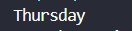

<div align="center">

# 🌐 HTML Learning Portfolio

### _For Undergraduate Computer Science Studies_

[](https://www.linkedin.com/in/mrnexora/)
[](https://github.com/mr-nexora/)

</div>

---

### 📝 Metadata & Credits

| Attribute               | Details                                                              |
| :---------------------- | :------------------------------------------------------------------- |
| **Author**              | T.M.S.U. Thennakoon (Sahan Udara)                                    |
| **Academic Context**    | Computer Science Undergraduate                                       |
| **Credits & Resources** | Inspired and learned via [W3Schools](https://www.w3schools.com/cpp/) |

> ⚠️ **Copyright Note**  
> Copyright (c) 2026 T.M.S.U. Thennakoon (Sahan Udara). All rights reserved.

---

# 🎛️ Lesson 14: C++ Switch Statements

This lesson introduces the `switch` statement as an efficient alternative to multi-stage `if...else if` chains. You will learn how to test an expression against multiple matching constant literal values, master the execution boundaries of the `break` keyword, and configure fallback operations via the `default` keyword.

---

## 📌 1. Introduction to the `switch` Structure

The `switch` statement evaluates an integral or character expression once and compares its result directly against values specified in structural **`case`** labels. It offers cleaner syntax and faster execution maps over long nested conditions due to compiler jump-table optimizations.

```CPP
    // test1.cpp
    int day = 4;

    switch (day)
    {
    case 1:
        cout << "Monday";
        break;
    case 2:
        cout << "Tuesday";
        break;
    case 3:
        cout << "Wednesday";
        break;
    case 4:
        cout << "Thursday";
        break;
    case 5:
        cout << "Friday";
        break;
    case 6:
        cout << "Saturday";
        break;
    case 7:
        cout << "Sunday";
        break;
    }
```

## 

---

## 2. The Crucial Role of the break Keyword

When a matching case value is detected, execution jumps straight to that specific block. The break keyword tells the compiler to break out of the switch statement completely once that block is finished.

⚠️ The Fall-Through Effect: If you omit a break; statement at the end of a case block, execution does not stop! The compiler continues down into the next sequential case blocks, running their code blindly regardless of whether the criteria keys match or not, until a break keyword or the end of the switch block is reached.

---

## 3. Handling Unmatched Criteria: The default Keyword

The default keyword specifies a fallback code block that runs automatically if none of the explicit case expressions match the evaluated criteria variable. Think of it as the final structural equivalent to an else statement inside a branching block.

```CPP
    // test2.cpp
    int day = 4;

    switch (day)
    {
    case 1:
        cout << "Monday";
        break;
    case 2:
        cout << "Tuesday";
        break;
    case 3:
        cout << "Wednesday";
        break;
    case 4:
        cout << "Thursday";
        break;
    case 5:
        cout << "Friday";
        break;
    case 6:
        cout << "Saturday";
        break;
    case 7:
        cout << "Sunday";
        break;
    default:
        cout << "Looking forward to the Weekend";
    }
```

## 
